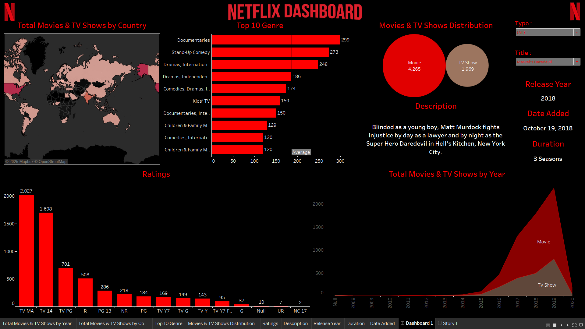

<p align="center">
  
</p>

<h1 align="center">📊 Netflix Analytics Dashboard</h1>

<p align="center">
  <strong>An interactive Tableau dashboard for exploring Netflix's global content library</strong>
</p>

<p align="center">
  
  
  
  
</p>

<p align="center">
  <a href="#-features">Features</a> •
  <a href="#-quick-start">Quick Start</a> •
  <a href="#-dashboard-preview">Preview</a> •
  <a href="#-dataset">Dataset</a> •
  <a href="#-usage">Usage</a>
</p>

---

## 📸 Dashboard Preview

<p align="center">
  
</p>

---

## ✨ Features

### 🌍 Geographic Analysis
- **World Map Visualization** — Explore Netflix's content distribution across 190+ countries
- Interactive country selection with real-time filtering

### 📈 Content Insights
| Visualization | Description |
|---------------|-------------|
| **Top 10 Genres** | Horizontal bar chart revealing the most popular content categories |
| **Movies vs TV Shows** | Bubble chart comparing the distribution (4,265 Movies • 1,969 TV Shows) |
| **Content Ratings** | Bar chart breakdown by rating (TV-MA, TV-14, PG-13, R, etc.) |
| **Timeline Trends** | Stacked area chart showing content releases from 1925 to 2020 |

### 🎬 Detailed Exploration
- **Title Search** — Find any specific movie or TV show instantly
- **Details Panel** — View synopsis, release year, date added & duration
- **Cross-filtering** — Click any chart element to filter the entire dashboard

---

## 📊 Key Statistics

<table align="center">
  <tr>
    <td align="center"><h3>6,234</h3><p>Total Titles</p></td>
    <td align="center"><h3>4,265</h3><p>Movies</p></td>
    <td align="center"><h3>1,969</h3><p>TV Shows</p></td>
    <td align="center"><h3>1925-2020</h3><p>Release Years</p></td>
  </tr>
</table>

### 🏆 Top Content Ratings
| Rating | Count |
|--------|-------|
| TV-MA | 2,027 |
| TV-14 | 1,698 |
| TV-PG | 701 |
| R | 508 |
| PG-13 | 286 |

### 🎭 Top Genres
1. **Documentaries** — 299 titles
2. **Stand-Up Comedy** — 273 titles
3. **Dramas, International Movies** — 248 titles
4. **Dramas, Independent Movies** — 186 titles
5. **Comedies, Dramas, International Movies** — 174 titles

---

## 🚀 Quick Start

### Prerequisites

| Requirement | Version |
|-------------|---------|
| **Tableau Desktop** or **Tableau Public** | 2019.4+ (recommended) |


### Open the Dashboard

1. **Launch** `netflix_dashboard.twb` in Tableau
2. **Connect Data** — If prompted, locate `netflix_dataset.xlsx` in the project folder
3. **Verify Sheet** — Ensure `netflix_titles` sheet is selected
4. **Explore** — Navigate to the `Dashboard 1` tab

---

## 📁 Dataset

The dashboard is powered by `netflix_dataset.xlsx` containing **6,234 records** across **12 fields**:

| Field | Type | Description |
|-------|------|-------------|
| `show_id` | String | Unique identifier (e.g., `s1`, `s2`) |
| `type` | String | `Movie` or `TV Show` |
| `title` | String | Title name |
| `director` | String | Director(s) — may be blank |
| `cast` | String | Cast list — may be blank |
| `country` | String | Production country/countries |
| `date_added` | Date | Date added to Netflix |
| `release_year` | Integer | Original release year |
| `rating` | String | Content rating (TV-MA, TV-14, PG-13, etc.) |
| `duration` | String | Runtime (minutes) or seasons |
| `listed_in` | String | Genre categories |
| `description` | String | Brief synopsis |

> ⚠️ **Note:** Some fields like `director`, `cast`, `country`, and `date_added` may contain null values or be multi-valued (comma-separated).

---

## 🎯 Usage

### Interactive Filters

| Filter | Function |
|--------|----------|
| **Type** | Switch between Movies, TV Shows, or All content |
| **Title** | Search and select specific titles |

### Exploration Tips

- 🖱️ **Hover** over any chart element for detailed tooltips
- 🔗 **Click** on bars, countries, or areas to cross-filter all visualizations
- 📎 **Export** insights via Tableau's Image/PDF/PowerPoint options

### Example Workflows

```
📍 Find top content by country:
   Click on a country → View filtered genre & rating distributions

🎬 Explore a specific title:
   Use Title filter → View complete details in the right panel

📅 Analyze content trends:
   Hover over timeline → See year-by-year breakdown
```

---

## 🔧 Troubleshooting

<details>
<summary><strong>❌ "Could not locate file / data source"</strong></summary>

When prompted, navigate to `netflix_dataset.xlsx` in the project folder.

**Alternative:** In Tableau, go to `Data → [data source] → Edit Connection...` and browse to the Excel file.
</details>

<details>
<summary><strong>🗺️ Map shows "Unknown" or missing countries</strong></summary>

Country values can be multi-valued (e.g., `United States, India`) or missing. Consider splitting/cleaning the `country` field for more precise geographic mapping.
</details>

<details>
<summary><strong>📅 Dates display incorrectly</strong></summary>

Ensure `date_added` is interpreted as a date type. The workbook expects format: `MMMM d, yyyy` (e.g., "January 15, 2020").
</details>

---

## 📂 Repository Structure

```
Netflix-Analytics-Dashboard/
│
├── 📊 netflix_dashboard.twb    # Tableau workbook (dashboard + worksheets)
├── 📑 netflix_dataset.xlsx     # Source data (6,234 Netflix titles)
├── 🖼️ netflix_dashboard.png    # Dashboard screenshot preview
└── 📖 README.md                # Project documentation
```

---

## 🤝 Share & Export

### Create a Packaged Workbook

To share without broken data paths:

```
File → Export Packaged Workbook... → Save as .twbx
```

> 📦 The `.twbx` format bundles both the workbook and data into a single file.

---

## 🤝 Contributing

Contributions are welcome! Here's how you can help:

1. **Fork the repository**
2. **Create a feature branch:** `git checkout -b feature/AmazingFeature`
3. **Commit your changes:** `git commit -m 'Add some AmazingFeature'`
4. **Push to the branch:** `git push origin feature/AmazingFeature`
5. **Open a Pull Request**

---

## 📬 Contact

**Developed by Ch Ayushman Patro**

[](https://www.linkedin.com/in/ch-ayushman-patro)  [](https://github.com/Ch-Ayushman-Patro)

For questions, suggestions, or collaboration opportunities, feel free to reach out!